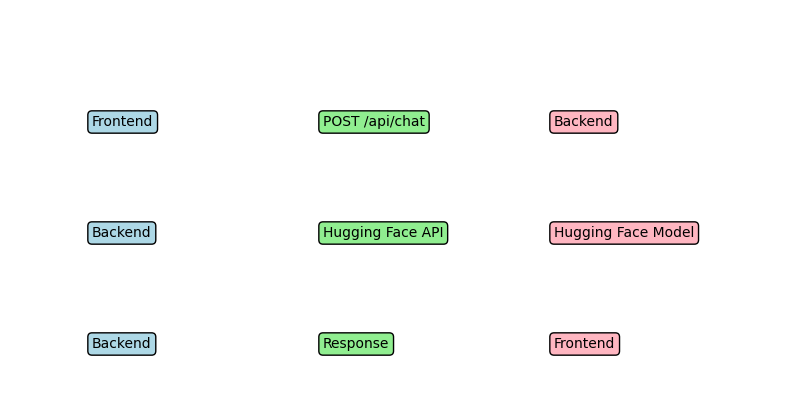
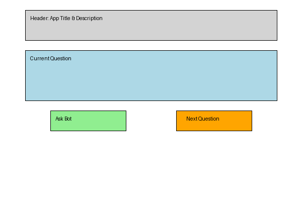

# Travel Quiz App

## Overview
An application where users answer travel-related questions, with AI-generated responses from Hugging Face models.

## Features
- Multiple travel categories
- AI-powered responses
- User-friendly interface

## API Route Design
- **POST /api/chat**: Accepts a question, returns AI-generated answer.
- **Parameters**:
  - `question` (string): The travel question asked by user.
- **Response**:
  - JSON object with `answer` string.

## Diagrams

## Tasks Breakdown
| Task | Assignee | Status |
|-------|------------|---------|
| Setup backend | Kadarius | Done |
| Frontend UI | Kadarius | Done |
| Integrate Hugging Face API | Kadarius | Done |
| Write documentation | Kadarius | Done |

## Hugging Face Model
- **Selected Model**: `gpt2`
- **Reason**: General-purpose language model with good support for conversational AI, theme-aligned with travel conversations.

## Links
- [GitHub Repository](https://github.com/kadariusclemons/travel-quiz)
- [Hugging Face Model](https://huggingface.co/gpt2)

## Local Testing Instructions
1. Clone repo.
2. Set up backend with environment variables.
3. Run backend (`node index.js`).
4. Run frontend (`npm start`).
5. Access app at `http://localhost:3000`.
